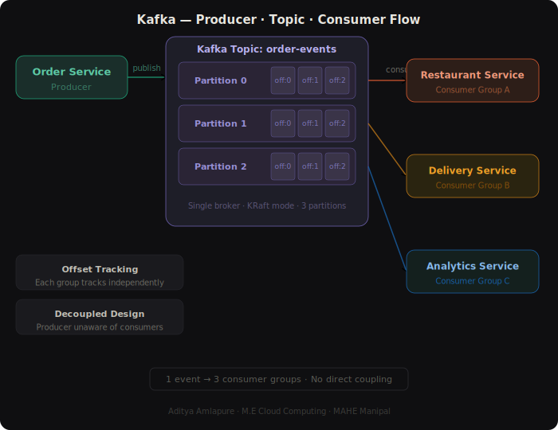

# 📡 Kafka Fundamentals
### Event Streaming · Producer · Consumer · Docker · KRaft

---

## 🚀 Introduction

This project is a hands-on implementation of **Apache Kafka** fundamentals — run locally using Docker, with real producer-consumer examples written in Python.

Built to understand how distributed event streaming works in real systems like food delivery apps, payment pipelines, and analytics platforms.

---

## ❓ The Problem Kafka Solves

In distributed systems, multiple services need the same data at the same time but for different reasons.

Without Kafka:
- Every service calls every other service directly
- Tight coupling, hard to scale, messy to maintain

With Kafka:
- One event published → multiple consumers read independently
- Producers and consumers stay completely decoupled
- Messages are stored and can be replayed

---

## 🏗️ Architecture

<p align="center">

</p>

> One `order_created` event flows from the **Order Service (Producer)** into the **Kafka Topic** across 3 partitions, consumed independently by Restaurant, Delivery, and Analytics services — each with their own Consumer Group and offset tracking.

---

## 🧩 Core Concepts

### 📤 Producer
Publishes events to a Kafka topic.
Example: Order service publishing `order_created` events continuously.

### 📋 Topic
A named stream of events. Example: `order-events`.
Topics are split into partitions for parallel processing.

### 🗂️ Partition
- Ordering guaranteed **within** a partition, not across the topic
- This project uses **3 partitions** per topic
- Each message has an **offset** — its position in the partition

### 📥 Consumer Group
- Same group → messages divided across consumers (load sharing)
- Different groups → each group gets its own full copy of the topic
- Each group tracks offsets independently

### 🔁 Offset
Kafka tracks which messages each consumer group has already read using offsets. This enables replay and fault tolerance.

---

## 🛠️ Tech Stack

| Tool | Purpose |
|---|---|
| Apache Kafka 3.8.0 | Event streaming platform |
| KRaft mode | No Zookeeper needed |
| Docker + Compose | Local Kafka setup |
| Python 3.11 | Producer & Consumer logic |
| Kafka UI | Visual topic & message browser |

---

## ⚙️ Local Setup

### Prerequisites
- Docker Desktop
- Python 3.11+

### 1. Clone and install
```bash
git clone https://github.com/Aditya-git21/kafka-fundamentals.git
cd kafka-fundamentals
python3 -m venv .venv
source .venv/bin/activate
pip install --upgrade pip
pip install -e .
```

### 2. Start Kafka
```bash
./scripts/start-kafka.sh
```
Kafka runs on `localhost:9092` · Kafka UI at `http://localhost:8080`

### 3. Stop Kafka
```bash
./scripts/stop-kafka.sh
```

---

## 🎬 Live Demo Flow

Open 4 terminals:

**Terminal 1 — Start Kafka**
```bash
./scripts/start-kafka.sh
```

**Terminal 2 — Create topic**
```bash
source .venv/bin/activate
python examples/live_topic_setup.py --topic order-events-live
```

**Terminal 3 — Start producer**
```bash
source .venv/bin/activate
python examples/live_producer.py --topic order-events-live --interval 1
```

**Terminal 4 — Start consumer**
```bash
source .venv/bin/activate
python examples/live_consumer.py --topic order-events-live
```

Watch events flow from producer to consumer in near real time.

---

## 🗂️ Project Structure

```text
.
├── README.md
├── compose.yaml
├── docs
│   └── kafka_architecture.svg
├── examples
│   ├── live_consumer.py
│   ├── live_producer.py
│   └── live_topic_setup.py
├── scripts
│   ├── start-kafka.sh
│   └── stop-kafka.sh
└── src
    └── kafka_zero_to_hero
        ├── __init__.py
        └── common.py
```

---

## ⚠️ Real Challenges with Kafka

| Challenge | Why it matters |
|---|---|
| No global ordering | Order only guaranteed per partition |
| Duplicate processing | Consumers must be idempotent |
| Schema discipline | Careless changes break consumers |
| Operational overhead | Needs monitoring, alerting, capacity planning |
| Overkill for small apps | Simple apps don't need this complexity |

---

## 📌 Status

- ✅ Local Kafka setup with Docker
- ✅ Producer publishing JSON events
- ✅ Consumer reading in real time
- ✅ Multi-consumer group demo
- ✅ Kafka UI for visual inspection

---

## 🔮 Future Enhancements

- 🔁 Schema Registry integration
- 📊 Prometheus metrics
- 🔐 SSL and SASL authentication
- 🌐 Deploy on AWS MSK
- 🧪 Consumer group lag monitoring

---

## 👤 Author

**Aditya Amlapure**  
M.E Cloud Computing · MAHE Manipal  
[LinkedIn](https://linkedin.com/in/aditya-amlapure21) · [GitHub](https://github.com/Aditya-git21)
